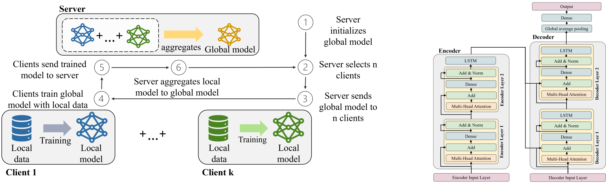

# Transformer based federated learning for secure short-term load forecasting in smart grids

> **Abstract:**
> *Electricity load forecasting is an essential task within smart grids to assist demand and supply balance. While advanced deep learning models require large amounts of high-resolution data for accurate short-term load predictions, fine-grained load profiles can expose users’ electricity consumption behaviors, which raises privacy and security concerns. One solution to improve data privacy is federated learning, where models are trained locally on private data, and only the trained model parameters are merged and updated on a global server. Therefore, this paper presents a novel transformer-based deep learning approach with federated learning for short-term electricity load prediction. To evaluate our results, we benchmark our federated learning architecture against central and local learning and compare the performance of our model to long short-term memory models and convolutional neural networks. Our simulations are based on a dataset from a German university campus and show that transformer-based forecasting is a promising alternative to state-of-the-art models within federated learning.*

Badges
This project provides a code base for federated, localized and centrlaized learning considering LSTM models, CNNs and Transformer. 

# Demo
Here is a demo

# Table of contents
table

# Instalation

# Usage

# Development

# Contribution

# License

# Footer
